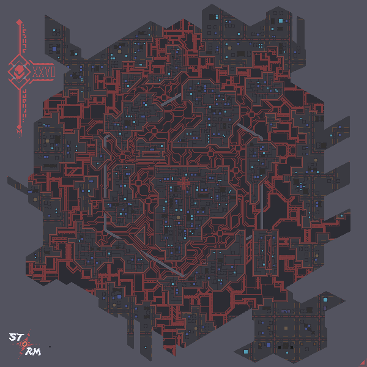
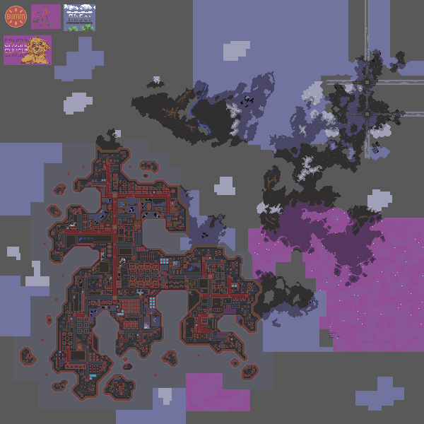
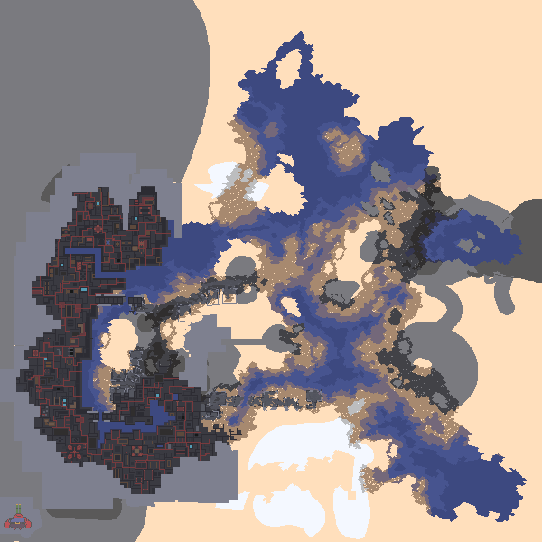
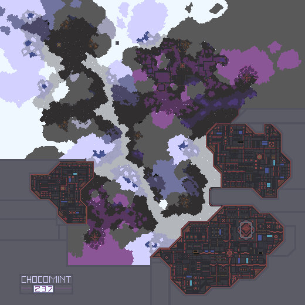
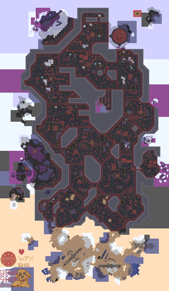
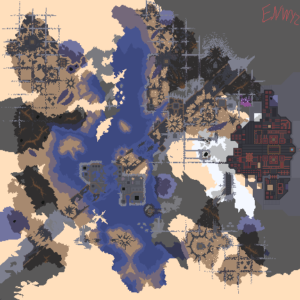
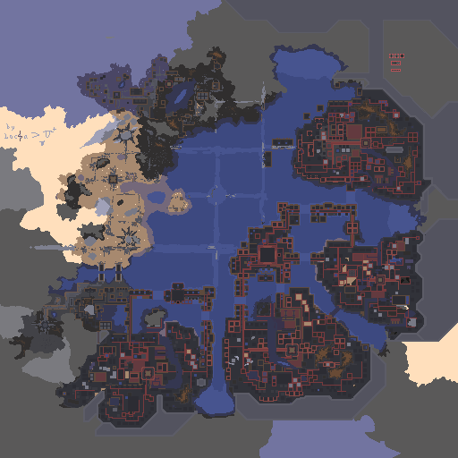

# 🌋 The Ring of Hell

### 🗺️ Набор из 7 карт-секторов для Mindustry

 

[]

---

## 📖 О моде

**The Ring of Hell** — это мод-пак карт (map-pack) для [Mindustry](https://mindustrygame.github.io/), добавляющий **7 полноценных секторов** (27, 242–247). Что-то скрывается в Кольце Ада... Сможете ли вы добраться до сути и выбраться живым?

---

## ✨ Возможности

| | |
|---|---|
| 🗺️ | **7 секторов** — карты 27, 242, 243, 244, 245, 246 и 247 со своим ландшафтом |
| 🌋 | **Атмосфера тайны** — мрачный сеттинг «Кольца Ада»: здесь что-то есть.../ |
| 🎮 | **Любой режим** — подходит для выживания, кооператива и PvP |
| 🧩 | **Только карты** — мод не трогает баланс и не требует других модов |

---

## 🗺️ Карты

| Сектор | Превью |
|---|---|
| **27** |  |
| **242** |  |
| **243** |  |
| **244** |  |
| **245** |  |
| **246** |  |
| **247** |  |

---

## 📦 Установка

### Вариант 1 — Импорт из GitHub (прямо в игре)

1. Откройте **Mindustry**;
2. Перейдите в **Mods → Import GitHub Mod**;
3. Вставьте ссылку: `https://github.com/Xenonixq/The-Ring-of-Hell`;
4. Дождитесь загрузки и включите мод.

### Вариант 2 — Скачать ZIP вручную

1. Нажмите **Code → Download ZIP** на странице репозитория;
2. Распакуйте архив (не удаляйте структуру папок `maps/` и `sprites/`);
3. В игре: **Mods → Import Mod** и укажите папку мода.

### После установки

Карты появятся в разделе **Maps (Карты)** → **Custom (Пользовательские)**.

---

## ⚙️ Совместимость

| Требование | Значение |
|---|---|
| 🎮 Игра | Mindustry **v160.5** и новее |
| ☕ Java | Не требуется (`java: false`) — чистый контент |
| 🧩 Зависимости | Нет |
| 🌐 Язык | Мультиязычная (карты не зависят от языка) |

---

## 📜 Лицензия

Распространяется под лицензией **GNU General Public License v3.0**. Полный текст — в файле [LICENSE.txt](LICENSE.txt).

---

**Сделано с ❤️ и 💥 для Mindustry**

